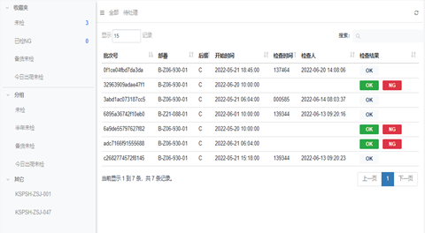

# R-MES 使用手册（V0.8）
# 一、标准R-MES简介
更新时间 2022-2-22  
 精益化物料管理  
 数字化计划排程  
 工位数字工作站  
 品质管控与追溯  
注塑型车间数字化方案，现场透明化，管理成本更低，作业效率更高。  

## 1.1、精益化物料管理

 全流程条码化管理  

原材料条码  
 移动端作业，便捷、高效。  
 物料在库可视化。  

## 1.2、数字化计划排程  
 生产计划预实绩  

## 1.3、工位数字工作站

## 1.4、品质管控与追溯  

# 二、基础准备  
更新时间 2022-2-22  
 标签条码化  
 移动终端设备  
 用户权限  
 IoT设备  
 基础参数  
## 2.1、标签条码化  

# 三、主要模块
更新时间 2022-2-22  
 计划管理  
 生产管理  
 产品管理  
 物料管理  
 运营管理  
## 3.1、计划管理
 生产排程  
计划排程：①、日期→②、业种→③、设备→④、计划内容→⑤、确定→⑥、保存

今日计划：当日设备别计划执行状态。

 生产准备  
通过PDA移动终端完成生产前相关准备事项的结果报告：设备启动(停止)→换模→调试→保养
启停报告： 设备别启动/停止时间报告，同时完成相关项目点检。

换模报告：换模担当、关联设备、关联计划、开始/结束时间的记录，同时完成相关项目点检。

调试报告：试模开始→结束时间、试做件数记录。

保养报告：保养实绩耗时记录。

## 3.2、生产管理
 生产执行  
逐箱扫码：完成品逐一装箱扫码，数据组批。

完成报告：设备别对应计划完成后，报告关联结果。

工程内不良报告：选择设备对应的计划记录不良品的类别和数量。

 3.2.4异常处置  
                设备异常、人员换休、包材需求、段取依赖、工程不良、送检依赖、浇口换箱、安全事件
等事项一键申告，快速处置。  
                      ①、一键报警  
                      ②、异常受理/处置  

 3.2.4数据查询  
                      ①、计划预实绩  
                      ②、报告实绩  
                      ③、产出实绩  
                      ④、工程内不良实绩  

## 3.3、物料管理  
全流程精益化管理，通过条码化，材料纳入、入库、出库、出库、领料、加料利用移动PDA作业，
便捷、高效，材料原流程在库状态可视化。   
        3.3.1、库存作业  
               ①、原材料条码标签打印  
               ②、原材料纳入  
               ③、原材料入库  
               ④、原材料出库  
               ⑤、原材料领料  
               ⑥、原材料加料  

3.3.2、其它作业(退库/废弃)  
                      ①、材料退库  
                      ②、材料废弃(原材料、粉碎料、浇口)   

3.3.3、查询一览  
            ①、物料总需求：每日加工物料需求  
            ②、物料清单：设备别加工完成品参数及物料参数  
            ③、在库查询：物流在库查询  
## 4.1、运营管理  
生产过程中主要对象参数的数字化。  
    具体Master内容：部品、模具、设备、工艺、材料、仓位、荷姿、类目。  

功能维护：对master数据进行增删改查、导入、导出。  
## 5.1、数字车间  
## 未完待续……  